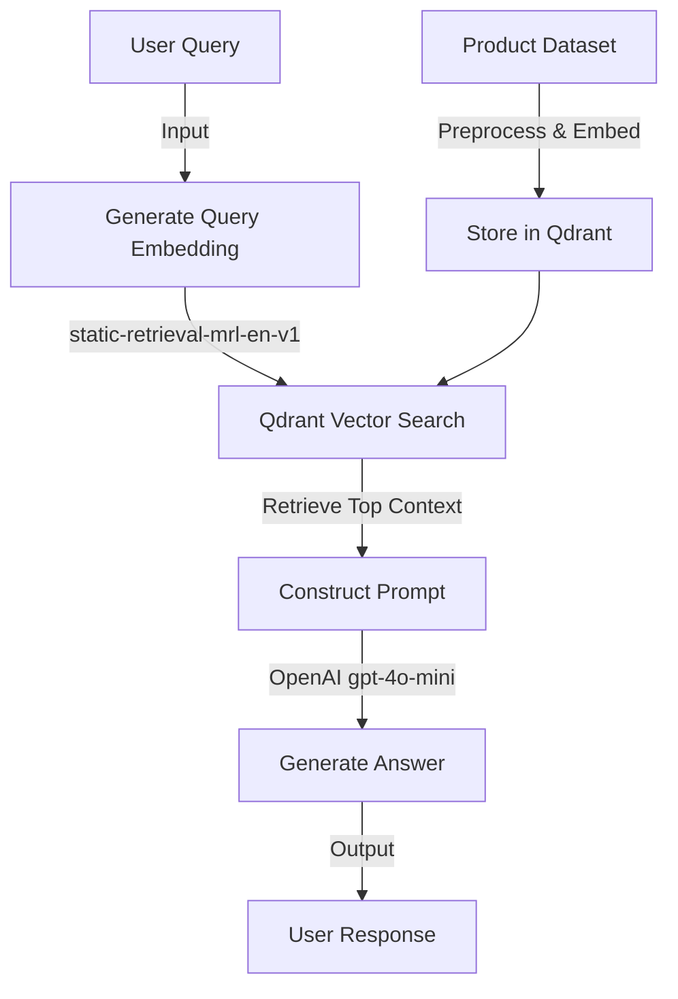

# Ecom-Flash-RAG ⚡
  
**Blazing-Fast E-commerce Chatbot Powered by RAG**

Welcome to **Ecom-Flash-RAG**, the ultimate Retrieval-Augmented Generation (RAG) chatbot for e-commerce! Experience lightning-fast product searches with answers delivered in a flash. Built with Qdrant for rapid vector retrieval, this project uses the ultra-fast `sentence-transformers/static-retrieval-mrl-en-v1` embedding model and OpenAI's `gpt-4o-mini` LLM to provide accurate, concise responses. Say goodbye to slow searches—Ecom-Flash-RAG ensures you get product details in record time, with features like duplicate removal and optimized retrieval.

## ✨ Features

- **⚡ Lightning-Speed Retrieval**: Sub-second product searches using Qdrant and the fastest embedding model.
- **🧠 Smart Responses**: Powered by OpenAI's `gpt-4o-mini` for accurate, natural answers.
- **🗑️ Duplicate-Free Data**: Removes duplicates based on embeddings for a clean dataset.
- **📦 Batch Uploads**: Efficiently handles large datasets with batch uploads to Qdrant.
- **⏩ Optimized Performance**: Limits results and excludes unnecessary data for minimal latency.

## 🏗️ Project Architecture

Here's how Ecom-Flash-RAG works its magic:



User Query: Input a query (e.g., "Which shirt is under ₹500?").

Embedding Generation: Query is embedded using static-retrieval-mrl-en-v1.

Vector Search: Qdrant retrieves the top product context via cosine similarity.

Prompt Construction: Combines context with the query for the LLM.

Answer Generation: gpt-4o-mini crafts a natural response.

Output: Delivers the answer to the user in a flash!

## Qdrant Vector Database
Ecom-Flash-RAG leverages Qdrant for high-speed vector storage and retrieval. Check out the Qdrant cluster details below:
Qdrant Node Graph
The cluster runs on a free tier with 1 node, 4GiB disk, 1GiB RAM, and 0.5 vCPUs, ensuring efficient vector searches.


## Prerequisites
- Python 3.8+
- Qdrant cluster (free tier or paid)
- OpenAI API key
- Required Python libraries (listed in requirements.txt)

## Installation

Clone the Repository:
```bash
git clone https://github.com/Shreyas-Patil-01/Ecom-Flash-RAG.git
cd Ecom-Flash-RAG
```

Set Up a Virtual Environment (optional but recommended):
```bash
python -m venv venv
source venv/bin/activate  
```

Install Dependencies:
```bash
pip install -r requirements.txt
```

The requirements.txt should include:
```
qdrant-client
sentence-transformers
openai
numpy
scikit-learn
```

Set Up Environment Variables:
Add your OpenAI API key:
```bash
export OPENAI_API_KEY="your-openai-api-key"
```

On Windows:
```bash
set OPENAI_API_KEY="your-openai-api-key"
```

## Usage

Run the Chatbot:
Start the RAG chatbot:
```bash
python rag_chatbot.py
```

Interact with the Chatbot:
Enter queries like:
- "Which shirt is under ₹500?"
- "Show me a black shirt."

Type `exit` to quit.

Example Interaction:
```
Welcome to the E-commerce Chatbot! Type 'exit' to quit.
Enter your query: Which shirt is under ₹500?

Answer: The "Men Regular Fit Color Block Casual Shirt" is under ₹500. It costs ₹349, comes in Dark Green and Black, and is a high-quality premium full-sleeves printed shirt from Blive, offering a clean and classy look with comfort.

Enter your query: exit
Goodbye!
```

## Performance Optimization
Ecom-Flash-RAG is built for speed:
- **Fastest Embedding Model**: Uses static-retrieval-mrl-en-v1 for rapid embedding generation.
- **Efficient Retrieval**: Limits Qdrant search to the top result and skips vectors.
- **Lightweight LLM**: gpt-4o-mini ensures quick answer generation.
- **Preloaded Models**: Loads the embedding model once to eliminate overhead.

## Contributing
We'd love your contributions! Open an issue or submit a pull request with your ideas.

## License
This project is licensed under the MIT License. See the LICENSE file for details.

## Contact
For questions or support, reach out to Shreyas Patil.
shreyaspatil4780@gmail.com